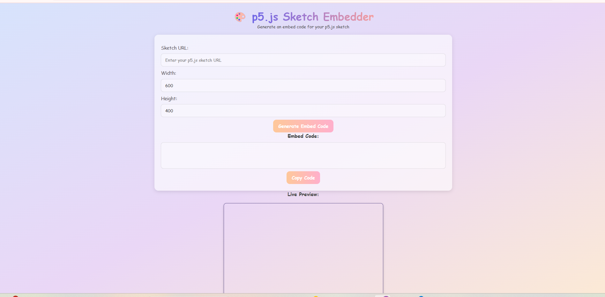

# 🎨 p5.js Sketch Embedder

## 🚀 About the Project
This is a simple and beautiful **p5.js Sketch Embedder** that allows users to generate embed codes for their p5.js sketches and preview them live. The design is minimal, soothing to the eyes, and fully responsive for mobile users.

## 🌟 Features
- 🎨 **Smooth UI with pastel colors** for a calming user experience.
- ✨ **Live Preview** of the embedded p5.js sketch.
- 📋 **One-click Copy Button** to quickly grab the embed code.
- 📱 **Fully Responsive Design** for mobile, tablet, and desktop views.
- 🌀 **Animated Header** with shrink & turn effects for an engaging look.

## 🔧 How to Use
1. Enter the **p5.js Sketch URL** (from [p5.js Web Editor](https://editor.p5js.org)).
2. Set the **Width** and **Height** (or leave default values).
3. Click **"Generate Embed Code"** to get the iframe code.
4. Copy the embed code and use it on your website.
5. The **Live Preview** section shows how your sketch will appear.

## 🌐 Live Demo
Check out the live version of this project here:  
🔗 **[p5.js Sketch Embedder](https://kumavatkomal.github.io/friendly-sketch-embedder/)**

## 📸 Screenshot
  


## 🛠️ Tech Stack
- **HTML** - Structure  
- **CSS (TailwindCSS)** - Styling  
- **JavaScript** - Functionality  
- **p5.js** - Embedded Sketch Support  

## 📌 Setup Instructions
If you want to run this project locally, follow these steps:

1. Clone this repository:
   ```bash
   git clone https://github.com/kumavatkomal/friendly-sketch-embedder.git
